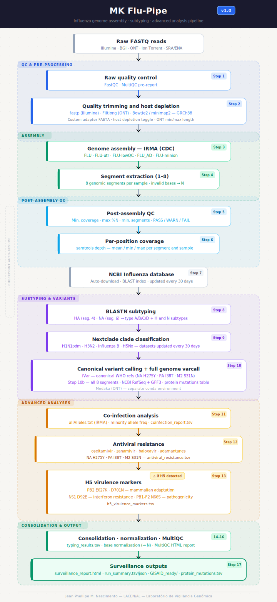

<div align="center">



# MK Flu-Pipe


**Ferramenta de montagem, subtipagem e análise avançada de genomas de Influenza**  
*Influenza genome assembly, subtyping, and advanced analysis pipeline*

Desenvolvido por / Developed by **Jean Phellipe Marques do Nascimento**  
Laboratório de Vigilância Genômica — **LACEN/AL** · Alagoas, Brasil

</div>

---

> 🇧🇷 **Português** | [🇺🇸 English ↓](#-english-version)

---

## 🇧🇷 Versão em Português

### Índice

- [O que é o MK Flu-Pipe?](#o-que-é-o-mk-flu-pipe)
- [O que o pipeline faz?](#-o-que-o-pipeline-faz)
- [Novidades da versão 1.0](#-novidades-da-versão-10)
- [Pré-requisitos](#-pré-requisitos-do-sistema)
- [Instalação](#️-instalação)
- [Como usar](#️-como-usar)
- [Módulos IRMA](#-módulos-irma)
- [Modos de entrada](#-modos-de-entrada)
- [Parâmetros](#-parâmetros)
- [Estrutura de saída](#-estrutura-de-saída)
- [Perguntas frequentes](#-perguntas-frequentes)
- [Autoria](#-autoria-e-contato)

---

### O que é o MK Flu-Pipe?

**MK Flu-Pipe** é uma ferramenta bioinformática desenvolvida no **Laboratório de Vigilância Genômica do LACEN/AL** para montagem, subtipagem e análise avançada de genomas do vírus Influenza a partir de dados de sequenciamento de nova geração (NGS).

> 💡 **Para quem não tem experiência em bioinformática:** pense no MK Flu-Pipe como uma "linha de montagem automatizada". Você fornece os arquivos brutos gerados pelo sequenciador (arquivos `.fastq.gz`) e a ferramenta cuida de todo o restante — limpeza dos dados, montagem do genoma viral, identificação do tipo e subtipo do vírus, análise de resistência a antivirais, classificação de clados evolutivos e geração de relatórios prontos para submissão ao GISAID — tudo de forma automática e rastreável.

A ferramenta oferece tanto uma **interface gráfica (GUI)** amigável quanto uso via **linha de comando (CLI)**.

#### Ferramentas integradas

| Ferramenta | Função |
|-----------|--------|
| **[IRMA (CDC)](https://wonder.cdc.gov/amd/flu/irma/)** | Montagem iterativa dos genomas a partir dos FASTQs brutos |
| **[FastQC](https://www.bioinformatics.babraham.ac.uk/projects/fastqc/)** | Controle de qualidade dos reads brutos |
| **[fastp](https://github.com/OpenGene/fastp)** | Trimagem e filtragem de qualidade (Illumina paired/single) |
| **[Filtlong](https://github.com/rrwick/Filtlong)** | Filtragem de reads long-read (ONT / Ion Torrent) |
| **[Bowtie2](http://bowtie-bio.sourceforge.net/bowtie2/) / [minimap2](https://github.com/lh3/minimap2)** | Depleção de reads do hospedeiro humano (GRCh38) |
| **[samtools](http://www.htslib.org/)** | Manipulação de BAM/SAM e cobertura por posição |
| **[BLAST (NCBI)](https://blast.ncbi.nlm.nih.gov/)** | Subtipagem dos segmentos HA e NA |
| **[Nextclade](https://clades.nextstrain.org/)** | Classificação de clados para H1N1pdm, H3N2, Flu B e H5Nx |
| **[iVar](https://github.com/andersen-lab/ivar)** | Variant calling canônico com GFF3 (Illumina/BGI) |
| **[Medaka](https://github.com/nanoporetech/medaka)** | Variant calling para dados ONT (long reads) |
| **[MultiQC](https://multiqc.info/)** | Relatório integrado de controle de qualidade |

---

### 🔬 O que o pipeline faz?

O MK Flu-Pipe executa **17 etapas sequenciais** (+ Step 10b), organizadas em seis grupos:

#### Grupo 1 — Controle de Qualidade (Steps 1–2) 🔵

- Avalia a qualidade dos reads brutos com **FastQC**
- Remove adaptadores e reads de baixa qualidade com **fastp** (Illumina) ou **Filtlong** (ONT)
- Remove reads humanos contaminantes com **Bowtie2** (short reads) ou **minimap2** (ONT) — opcional

#### Grupo 2 — Montagem (Steps 3–4) 🟢

- Monta os genomas virais com **IRMA** (algoritmo iterativo do CDC)
- Extrai os **8 segmentos genômicos** de cada amostra

#### Grupo 3 — QC Pós-montagem (Steps 5–7) 🔷

- Avalia cobertura mínima, % de bases N e número de segmentos montados
- Classifica cada amostra como **PASS**, **WARN** ou **FAIL**
- Calcula cobertura por posição com **samtools depth**
- Atualiza automaticamente o banco de dados NCBI Influenza (a cada 30 dias)

#### Grupo 4 — Subtipagem e Variant Calling (Steps 8–10b) 🟣

- Subtipa os segmentos HA e NA por **BLASTN** contra o banco NCBI Influenza
- Classifica o clado evolutivo com **Nextclade** (H1N1pdm, H3N2, Flu B, H5Nx)
- Realiza variant calling canônico com **iVar** (Illumina) ou **Medaka** (ONT)
- **Step 10b** — variant calling em todos os 8 segmentos contra RefSeqs `NC_*` do NCBI com anotação GFF3: gera tabela de mutações proteicas (`protein_mutations.tsv`)

#### Grupo 5 — Análises Avançadas (Steps 11–13) 🟡

- **Step 11** — Detecta co-infecção/mistura de subtipos a partir dos arquivos `allAlleles.txt` do IRMA
- **Step 12** — Identifica mutações de resistência a antivirais (oseltamivir, zanamivir, baloxavir, amantadinas)
- **Step 13** — Analisa marcadores de virulência H5: PB2 E627K/D701N, NS1 D92E, PB1-F2 N66S — *ativado apenas se H5 for detectado*

#### Grupo 6 — Outputs Finais (Steps 14–17) 🟢

- Consolida todos os resultados em `typing_results.tsv`
- Gera relatório **MultiQC** integrado
- Produz `surveillance_report.html` interativo com todas as tabelas
- Gera arquivos **FASTA e CSV prontos para submissão ao GISAID** (formato EpiFlu)

> 💡 **Sistema de checkpoint:** o pipeline retoma automaticamente de onde parou, sem reprocessar amostras já concluídas. Se a execução for interrompida (queda de energia, Ctrl+C etc.), basta rodar o mesmo comando novamente.

---

### 🆕 Novidades da versão 1.0

| Novidade | Descrição |
|----------|-----------|
| **`--seq_type`** | Seletor explícito de tipo de dado: `short_paired`, `short_single`, `long`, `auto` |
| **Step 10b — Full genome varcall** | Variant calling em todos os 8 segmentos com RefSeq NCBI + GFF3; tabela de mutações proteicas por amostra |
| **Step 11 — Co-infecção** | Detecção de amostras com múltiplas populações virais via `allAlleles.txt` |
| **Step 12 — Resistência antiviral** | Banco FluSurver/WHO com posições canônicas (oseltamivir, baloxavir, amantadinas) |
| **Step 13 — Virulência H5** | Marcadores automáticos se H5 detectado (E627K, D701N, D92E, N66S) |
| **GISAID-ready** | Headers FASTA no formato `A/localidade/código/ano(HxNy)` + template CSV EpiFlu |
| **GUI v1.0** | Interface gráfica GTK3 com todas as análises avançadas e persistência de configuração |
| **17 checkpoints** | Retomada granular de qualquer etapa interrompida |

---

### 📋 Pré-requisitos do sistema

> ⚠️ Todos os comandos devem ser executados em terminal Linux. Para usuários Windows, veja a seção [WSL2](#windows-wsl2) abaixo.

#### Sistema operacional

| Sistema | Suporte |
|---------|---------|
| **Linux** (Ubuntu 20.04+, Debian 11+) | ✅ Recomendado |
| **macOS** (via terminal) | ✅ Compatível |
| **Windows 10/11** via WSL2 | ✅ Compatível |

#### Hardware mínimo recomendado

| Recurso | Mínimo | Recomendado |
|---------|--------|-------------|
| CPU | 8 cores | 16+ cores |
| RAM | 16 GB | 32+ GB |
| Disco | 20 GB livres | 100+ GB (com GRCh38) |

#### Windows — WSL2

```powershell
# No PowerShell (como Administrador):
wsl --install
# Reinicie o computador e configure o Ubuntu quando solicitado
```

Após reiniciar, abra o Ubuntu e siga a instalação normalmente.

---

### 🛠️ Instalação

#### 1. Instalar IRMA

```bash
# Download do instalador (substitua pelo link atual em https://wonder.cdc.gov/amd/flu/irma/)
wget https://wonder.cdc.gov/amd/flu/irma/flu-amd-*.tar.gz
tar -xzf flu-amd-*.tar.gz -C ~/tools/
```

Adicione ao PATH (permanente):

```bash
echo 'export PATH="$HOME/tools/flu-amd:$PATH"' >> ~/.bashrc
source ~/.bashrc

# Confirme:
IRMA --help
```

#### 2. Instalar Miniconda3

```bash
wget https://repo.anaconda.com/miniconda/Miniconda3-latest-Linux-x86_64.sh
bash Miniconda3-latest-Linux-x86_64.sh
source ~/.bashrc
```

#### 3. Criar o ambiente conda `mk_flu`

```bash
conda create -n mk_flu -c bioconda -c conda-forge -c defaults \
    python=3.10 blast nextclade fastp fastqc filtlong \
    bowtie2 minimap2 samtools ivar multiqc entrez-direct \
    -y
```

#### 4. Instalar dependências da GUI

```bash
# Ubuntu/Debian:
sudo apt update && sudo apt install -y python3-gi python3-gi-cairo gir1.2-gtk-3.0
```

#### 5. Clonar o repositório

```bash
git clone https://github.com/nascimento-jean/MK_Flu-Pipe.git ~/tools/MK_Flu-Pipe
cd ~/tools/MK_Flu-Pipe
chmod +x script_influenza_gui.sh
```

#### 6. Instalar o launcher global (opcional)

Para abrir a GUI de qualquer diretório digitando apenas `MK_Flu-Pipe`:

```bash
bash install_mkflupipe.sh
source ~/.bashrc
```

#### Ambiente Medaka (opcional — apenas para dados ONT)

```bash
conda create -n medaka_env -c conda-forge -c bioconda medaka -y
```

---

### ▶️ Como usar

#### Interface gráfica (GUI) — recomendada para iniciantes

```bash
# De qualquer diretório (após instalar o launcher):
MK_Flu-Pipe

# Ou diretamente:
cd ~/tools/MK_Flu-Pipe
python3 gui_pipeline.py
```

Na GUI, selecione o diretório de entrada, saída e módulo IRMA, configure as análises avançadas e clique em **Run Pipeline**.

#### Linha de comando (CLI)

```bash
bash ~/tools/MK_Flu-Pipe/script_influenza_gui.sh \
    /caminho/para/fastqs \
    /caminho/para/saida \
    FLU \
    "" \
    --run_fastqc yes \
    --host_depletion yes \
    --ivar yes \
    --antiviral yes \
    --h5_virulence yes \
    --fullvarcall yes \
    --gisaid_location Brazil-AL \
    --gisaid_year 2025
```

#### Exemplo completo — dados Illumina paired-end

```bash
bash script_influenza_gui.sh \
    ~/dados/illumina_run01 \
    ~/resultados/run01 \
    FLU-utr \
    "" \
    --seq_type short_paired \
    --min_len_short 75 \
    --min_qual 20 \
    --host_depletion yes \
    --ivar yes \
    --ivar_freq 0.03 \
    --antiviral yes \
    --fullvarcall yes \
    --gisaid_location Brazil-AL \
    --gisaid_year 2025
```

---

### 🧩 Módulos IRMA

| Módulo | Quando usar |
|--------|-------------|
| `FLU` | Uso geral — Illumina/BGI, dados de qualidade padrão |
| `FLU-utr` | Inclui regiões UTR; genoma mais completo |
| `FLU-lowQC` | Amostras com baixa qualidade ou baixo input genético |
| `FLU_AD` | Quando se suspeita de Influenza C ou D |
| `FLU-minion` | Dados Oxford Nanopore (long reads) |

---

### 📥 Modos de entrada

| Modo | Padrão de arquivo esperado | Origem típica |
|------|---------------------------|---------------|
| `short_paired` | `amostra_R1.fastq.gz` + `_R2` | Illumina, BGI, SRA/ENA |
| `short_single` | `amostra.fastq.gz` (sem par) | Illumina single-end, Ion Torrent |
| `long` | `amostra.fastq.gz` | Oxford Nanopore |
| `auto` | Detectado automaticamente | Qualquer formato |

> 💡 Com `auto`, o pipeline reconhece automaticamente os padrões `_R1/_R2`, `_1/_2`, `_L001_R1_001` e similares.

---

### 🔧 Parâmetros

| Parâmetro | Padrão | Descrição |
|-----------|--------|-----------|
| `--seq_type` | `auto` | Tipo de dado: `short_paired`, `short_single`, `long` |
| `--run_fastqc` | `yes` | Executa FastQC nos reads brutos |
| `--adapter_fasta` | — | FASTA com adaptadores/primers para o fastp |
| `--min_len_short` | `75` | Comprimento mínimo de read Illumina após trimagem |
| `--min_len_long` | `200` | Comprimento mínimo de read ONT |
| `--max_len_long` | `0` | Comprimento máximo ONT (0 = sem limite) |
| `--min_qual` | `20` | Qualidade Phred mínima |
| `--host_depletion` | `no` | Remove reads humanos (GRCh38) |
| `--min_coverage` | `50` | Cobertura mínima por segmento para PASS |
| `--max_n_pct` | `10` | % máximo de bases N por segmento |
| `--min_segments` | `4` | Número mínimo de segmentos para PASS |
| `--ivar` | `no` | Variant calling canônico com iVar (short reads) |
| `--ivar_freq` | `0.03` | Frequência mínima de variante (iVar) |
| `--ivar_depth` | `10` | Profundidade mínima de cobertura (iVar) |
| `--medaka` | `no` | Variant calling com Medaka (ONT) |
| `--medaka_env` | `medaka_env` | Nome do ambiente conda do Medaka |
| `--minority_freq` | `0.20` | Freq. mínima de alelo minoritário (co-infecção) |
| `--coinfection_pct` | `5.0` | % de posições bimodais para alerta de co-infecção |
| `--antiviral` | `yes` | Análise de resistência a antivirais |
| `--h5_virulence` | `yes` | Análise de marcadores H5 (se detectado) |
| `--fullvarcall` | `no` | Variant calling em todos os segmentos com RefSeq + GFF3 |
| `--gisaid_location` | — | Localidade para o header GISAID (ex: `Brazil-AL`) |
| `--gisaid_year` | ano atual | Ano de coleta para o header GISAID |

---

### 📁 Estrutura de saída

```
output/
├── <amostra>/                        ← Output bruto do IRMA por amostra
│   ├── amended_consensus/            ← Consensos por segmento
│   ├── tables/                       ← allAlleles.txt e tabelas IRMA
│   └── ...
│
├── assembly_final/
│   ├── <amostra>.fasta               ← Genoma completo (todos os segmentos)
│   ├── assembly_qc_report.tsv        ← QC pós-montagem por amostra
│   ├── typing_results.tsv            ← ★ ARQUIVO PRINCIPAL DE RESULTADOS
│   ├── depth_summary.tsv             ← Cobertura por posição (samtools depth)
│   ├── coinfection_report.tsv        ← Análise de co-infecção
│   ├── antiviral_resistance.tsv      ← Mutações de resistência antiviral
│   ├── h5_virulence_markers.tsv      ← Marcadores de virulência H5
│   ├── segments/                     ← Segmentos 1–8 individuais
│   ├── blast_results/                ← TSVs brutos do BLASTN
│   └── nextclade_results/            ← TSVs brutos do Nextclade
│
├── full_variant_calls/               ← ★ Variant calling todos os segmentos
│   ├── <amostra>/
│   │   ├── *_ivar.tsv                ← Variantes iVar por segmento
│   │   └── *_protein_mutations.tsv  ← Mutações proteicas por segmento
│   └── all_samples_protein_mutations.tsv  ← Tabela agregada de todas as amostras
│
├── depth_per_position/               ← Profundidade por posição/segmento
├── variant_calls/                    ← iVar / Medaka canônicos (NA, PA, MP)
│
├── qc_reports/
│   ├── fastqc_raw/                   ← FastQC reads brutos
│   ├── fastp/                        ← Relatórios fastp/Filtlong
│   └── multiqc_report/               ← ★ Relatório MultiQC integrado (HTML)
│
├── Surveillance_Outputs/             ← ★ Outputs padronizados de vigilância
│   ├── coverage_per_segment.tsv      ← Cobertura por segmento (todas as amostras)
│   ├── run_summary.tsv               ← Resumo da corrida + metadados
│   ├── run_summary.json              ← Mesmo conteúdo em JSON
│   ├── multisample_consensus.fasta   ← FASTA multi-amostra concatenado
│   ├── surveillance_report.html      ← ★ Relatório HTML interativo
│   ├── GISAID_ready/                 ← ★ FASTA + template CSV EpiFlu
│   └── README_outputs.txt            ← Descrição de todos os arquivos de saída
│
├── run_log.txt                       ← Log completo de execução
└── .checkpoints/                     ← Arquivos de checkpoint (não deletar)
```

#### Entendendo o `typing_results.tsv`

Este é o arquivo principal — uma linha por amostra:

| Coluna | Descrição |
|--------|-----------|
| `sample` | Nome da amostra |
| `type` | Tipo de Influenza: A, B, C ou D |
| `subtype_HA` | Componente H (ex: `H1`, `H3`, `H5`) |
| `subtype_NA` | Componente N (ex: `N1`, `N2`) |
| `blast_classification` | Subtipo completo (ex: `H3N2`) ou linhagem B |
| `nextclade_clade` | Clado evolutivo ou `—` se sem dataset |
| `qc_nextclade` | `good`, `mediocre`, `bad` ou `—` |
| `classification_source` | `BLAST` ou `BLAST+Nextclade` |
| `hit_blast_HA` | Melhor hit BLAST para o segmento HA |
| `segments` | Segmentos montados separados por `\|` |
| `qc_assembly` | `PASS`, `WARN` ou `FAIL` |
| `qc_detail` | Detalhes do QC (ex: `segs:8/8`, `low_cov:PB2(30x)`) |

---

### ❓ Perguntas frequentes

**Os arquivos FASTQ precisam seguir alguma convenção de nome?**  
Não. Use `--seq_type auto` — o pipeline detecta automaticamente padrões `_R1/_R2`, `_1/_2` e `_L001_R1_001`.

**O pipeline foi interrompido. Preciso começar do zero?**  
Não. O sistema de checkpoints retoma automaticamente de onde parou. Execute o mesmo comando com os mesmos diretórios.

**Quanto espaço em disco é necessário?**  
~5 GB para o banco NCBI Influenza + ~3 GB para o índice GRCh38 (se usar depleção de hospedeiro) + dados da corrida. O Step 10b baixa RefSeqs `NC_*` adicionais (~30 MB) na primeira execução.

**Funciona com dados Nanopore?**  
Sim. Use o módulo `FLU-minion` e `--seq_type long`. O Filtlong faz a filtragem, minimap2 faz a depleção do hospedeiro, IRMA faz a montagem e Medaka faz o variant calling (ambiente separado).

**O que significa `WARN` ou `FAIL` no `qc_assembly`?**  
`WARN`: um segmento teve cobertura abaixo do mínimo ou %N acima do limite. `FAIL`: menos segmentos do que o mínimo requerido foram montados. Os detalhes estão sempre na coluna `qc_detail`.

**Como gerar os outputs prontos para o GISAID?**  
Adicione `--gisaid_location Brazil-AL --gisaid_year 2025` ao comando, ou preencha os campos GISAID na GUI. O pipeline gera automaticamente FASTA e CSV no formato EpiFlu.

**Posso usar no Windows?**  
Sim, via WSL2. No Windows 11 com WSLg, a interface gráfica também funciona nativamente.

**Quanto tempo leva uma corrida?**  
Para 12–24 amostras Illumina, tipicamente 30 minutos a 2 horas. A primeira corrida pode ser mais longa pelo download automático dos bancos de dados.

**O pipeline detecta Influenza C e D?**  
Sim, com o módulo `FLU_AD`.

**Posso analisar dados públicos do SRA/ENA?**  
Sim. Baixe os FASTQs do SRA/ENA, coloque em uma pasta e aponte `--seq_type auto` para ela.

**O que é o Step 10b e quando usar?**  
O Step 10b realiza variant calling em todos os 8 segmentos (não apenas NA, PA e MP) usando RefSeqs `NC_*` do NCBI com anotação GFF3, gerando uma tabela de mutações proteicas por amostra. É útil para vigilância ampla de mutações em qualquer gene. Ative com `--fullvarcall yes` ou pelo toggle na GUI.

---

### 👨‍🔬 Autoria e contato

Desenvolvido por **Jean Phellipe Marques do Nascimento**  
Laboratório de Vigilância Genômica — **LACEN/AL**  
Laboratório Central de Alagoas, Brasil

Para dúvidas, problemas ou sugestões, abra uma [**Issue**](https://github.com/nascimento-jean/MK_Flu-Pipe/issues).

---

### 📄 Licença

Distribuído para uso acadêmico e de saúde pública. Consulte as licenças das ferramentas integradas:  
[IRMA](https://wonder.cdc.gov/amd/flu/irma/disclaimer.html) · [BLAST](https://www.ncbi.nlm.nih.gov/IEB/ToolBox/CPP_DOC/lxr/source/scripts/projects/blast/LICENSE) · [Nextclade](https://github.com/nextstrain/nextclade/blob/master/LICENSE) · [fastp](https://github.com/OpenGene/fastp/blob/master/LICENSE) · [iVar](https://github.com/andersen-lab/ivar/blob/master/LICENSE) · [MultiQC](https://github.com/MultiQC/MultiQC/blob/main/LICENSE) · [samtools](https://github.com/samtools/samtools/blob/develop/LICENSE)

---

---

## 🇺🇸 English Version

### Table of contents

- [What is MK Flu-Pipe?](#what-is-mk-flu-pipe)
- [What does the pipeline do?](#-what-does-the-pipeline-do)
- [Whats new in v1.0](#-whats-new-in-v10)
- [System requirements](#-system-requirements)
- [Installation](#️-installation-1)
- [How to use](#️-how-to-use-1)
- [IRMA modules](#-irma-modules)
- [Input modes](#-input-modes)
- [Parameters](#-parameters)
- [Output structure](#-output-structure-1)
- [FAQ](#-faq)
- [Authorship](#-authorship-and-contact-1)

---

### What is MK Flu-Pipe?

**MK Flu-Pipe** is a bioinformatics pipeline developed at the **Genomic Surveillance Laboratory of LACEN/AL** (Alagoas Central Public Health Laboratory, Brazil) for assembly, subtyping, and advanced analysis of Influenza virus genomes from next-generation sequencing (NGS) data.

> 💡 **If you are new to bioinformatics:** think of MK Flu-Pipe as an automated assembly line. You provide the raw files produced by the sequencer (`.fastq.gz` files) and the tool handles everything else — data cleaning, viral genome assembly, virus type and subtype identification, antiviral resistance analysis, evolutionary clade classification, and generation of reports ready for GISAID submission — all automatically and traceably.

The tool offers both a user-friendly **graphical interface (GUI)** and **command-line (CLI)** usage.

#### Integrated tools

| Tool | Function |
|------|---------|
| **[IRMA (CDC)](https://wonder.cdc.gov/amd/flu/irma/)** | Iterative genome assembly from raw FASTQs |
| **[FastQC](https://www.bioinformatics.babraham.ac.uk/projects/fastqc/)** | Raw read quality control |
| **[fastp](https://github.com/OpenGene/fastp)** | Quality trimming and filtering (Illumina paired/single) |
| **[Filtlong](https://github.com/rrwick/Filtlong)** | Long-read filtering (ONT / Ion Torrent) |
| **[Bowtie2](http://bowtie-bio.sourceforge.net/bowtie2/) / [minimap2](https://github.com/lh3/minimap2)** | Human host read depletion (GRCh38) |
| **[samtools](http://www.htslib.org/)** | BAM/SAM manipulation and per-position coverage |
| **[BLAST (NCBI)](https://blast.ncbi.nlm.nih.gov/)** | HA and NA segment subtyping |
| **[Nextclade](https://clades.nextstrain.org/)** | Clade classification for H1N1pdm, H3N2, Flu B, H5Nx |
| **[iVar](https://github.com/andersen-lab/ivar)** | Canonical variant calling with GFF3 (Illumina/BGI) |
| **[Medaka](https://github.com/nanoporetech/medaka)** | Variant calling for ONT long-read data |
| **[MultiQC](https://multiqc.info/)** | Integrated quality control report |

---

### 🔬 What does the pipeline do?

MK Flu-Pipe runs **17 sequential steps** (+ Step 10b), organized into six groups:

#### Group 1 — Quality Control (Steps 1–2) 🔵

- Evaluates raw read quality with **FastQC**
- Removes adapters and low-quality reads with **fastp** (Illumina) or **Filtlong** (ONT)
- Removes human contaminating reads with **Bowtie2** (short reads) or **minimap2** (ONT) — optional

#### Group 2 — Assembly (Steps 3–4) 🟢

- Assembles viral genomes with **IRMA** (CDC iterative meta-assembler)
- Extracts the **8 genomic segments** from each sample

#### Group 3 — Post-assembly QC (Steps 5–7) 🔷

- Evaluates minimum coverage, % N bases, and number of assembled segments
- Classifies each sample as **PASS**, **WARN**, or **FAIL**
- Calculates per-position coverage with **samtools depth**
- Automatically updates the NCBI Influenza database (every 30 days)

#### Group 4 — Subtyping and Variant Calling (Steps 8–10b) 🟣

- Subtypes HA and NA segments by **BLASTN** against the NCBI Influenza database
- Classifies evolutionary clade with **Nextclade** (H1N1pdm, H3N2, Flu B, H5Nx)
- Performs canonical variant calling with **iVar** (Illumina) or **Medaka** (ONT)
- **Step 10b** — variant calling across all 8 segments against NCBI `NC_*` RefSeqs with GFF3 annotation: generates a protein mutation table (`protein_mutations.tsv`)

#### Group 5 — Advanced Analyses (Steps 11–13) 🟡

- **Step 11** — Detects co-infection/subtype mixing from IRMA `allAlleles.txt` files
- **Step 12** — Identifies antiviral resistance mutations (oseltamivir, zanamivir, baloxavir, adamantanes)
- **Step 13** — Analyzes H5 virulence markers: PB2 E627K/D701N, NS1 D92E, PB1-F2 N66S — *activated only if H5 is detected*

#### Group 6 — Final Outputs (Steps 14–17) 🟢

- Consolidates all results in `typing_results.tsv`
- Generates integrated **MultiQC** report
- Produces interactive `surveillance_report.html` with all tables
- Generates **FASTA and CSV files ready for GISAID submission** (EpiFlu format)

> 💡 **Checkpoint system:** the pipeline automatically resumes from where it stopped, without reprocessing completed samples. If execution is interrupted (power failure, Ctrl+C, etc.), simply run the same command again.

---

### 🆕 What's new in v1.0

| Feature | Description |
|---------|-------------|
| **`--seq_type`** | Explicit data type selector: `short_paired`, `short_single`, `long`, `auto` |
| **Step 10b — Full genome varcall** | Variant calling across all 8 segments with NCBI RefSeq + GFF3; protein mutation table per sample |
| **Step 11 — Co-infection** | Detection of samples with multiple viral populations via `allAlleles.txt` |
| **Step 12 — Antiviral resistance** | FluSurver/WHO database with canonical positions (oseltamivir, baloxavir, adamantanes) |
| **Step 13 — H5 virulence** | Automatic markers if H5 detected (E627K, D701N, D92E, N66S) |
| **GISAID-ready** | FASTA headers in `A/location/code/year(HxNy)` format + EpiFlu CSV template |
| **GUI v1.0** | GTK3 graphical interface with all advanced analyses and configuration persistence |
| **17 checkpoints** | Granular resume from any interrupted step |

---

### 📋 System requirements

> ⚠️ All commands should be run in a Linux terminal. For Windows users, see the [WSL2](#windows-wsl2-1) section below.

#### Operating system

| System | Support |
|--------|---------|
| **Linux** (Ubuntu 20.04+, Debian 11+) | ✅ Recommended |
| **macOS** (via terminal) | ✅ Compatible |
| **Windows 10/11** via WSL2 | ✅ Compatible |

#### Minimum recommended hardware

| Resource | Minimum | Recommended |
|----------|---------|-------------|
| CPU | 8 cores | 16+ cores |
| RAM | 16 GB | 32+ GB |
| Disk | 20 GB free | 100+ GB (with GRCh38) |

#### Windows — WSL2

```powershell
# In PowerShell (as Administrator):
wsl --install
# Restart and configure Ubuntu when prompted
```

After restarting, open Ubuntu and follow the installation steps normally.

---

### 🛠️ Installation

#### 1. Install IRMA

```bash
# Download the installer (get the current link from https://wonder.cdc.gov/amd/flu/irma/)
wget https://wonder.cdc.gov/amd/flu/irma/flu-amd-*.tar.gz
tar -xzf flu-amd-*.tar.gz -C ~/tools/
```

Add to PATH (permanent):

```bash
echo 'export PATH="$HOME/tools/flu-amd:$PATH"' >> ~/.bashrc
source ~/.bashrc

# Verify:
IRMA --help
```

#### 2. Install Miniconda3

```bash
wget https://repo.anaconda.com/miniconda/Miniconda3-latest-Linux-x86_64.sh
bash Miniconda3-latest-Linux-x86_64.sh
source ~/.bashrc
```

#### 3. Create the `mk_flu` conda environment

```bash
conda create -n mk_flu -c bioconda -c conda-forge -c defaults \
    python=3.10 blast nextclade fastp fastqc filtlong \
    bowtie2 minimap2 samtools ivar multiqc entrez-direct \
    -y
```

#### 4. Install GUI dependencies

```bash
# Ubuntu/Debian:
sudo apt update && sudo apt install -y python3-gi python3-gi-cairo gir1.2-gtk-3.0
```

#### 5. Clone the repository

```bash
git clone https://github.com/nascimento-jean/MK_Flu-Pipe.git ~/tools/MK_Flu-Pipe
cd ~/tools/MK_Flu-Pipe
chmod +x script_influenza_gui.sh
```

#### 6. Install the global launcher (optional)

To open the GUI from any directory by typing `MK_Flu-Pipe`:

```bash
bash install_mkflupipe.sh
source ~/.bashrc
```

#### Medaka environment (optional — ONT data only)

```bash
conda create -n medaka_env -c conda-forge -c bioconda medaka -y
```

---

### ▶️ How to use

#### Graphical interface (GUI) — recommended for beginners

```bash
# From any directory (after installing the launcher):
MK_Flu-Pipe

# Or directly:
cd ~/tools/MK_Flu-Pipe
python3 gui_pipeline.py
```

In the GUI, select input directory, output directory, and IRMA module, configure advanced analyses, and click **Run Pipeline**.

#### Command line (CLI)

```bash
bash ~/tools/MK_Flu-Pipe/script_influenza_gui.sh \
    /path/to/fastqs \
    /path/to/output \
    FLU \
    "" \
    --run_fastqc yes \
    --host_depletion yes \
    --ivar yes \
    --antiviral yes \
    --h5_virulence yes \
    --fullvarcall yes \
    --gisaid_location Brazil-AL \
    --gisaid_year 2025
```

#### Full example — Illumina paired-end data

```bash
bash script_influenza_gui.sh \
    ~/data/illumina_run01 \
    ~/results/run01 \
    FLU-utr \
    "" \
    --seq_type short_paired \
    --min_len_short 75 \
    --min_qual 20 \
    --host_depletion yes \
    --ivar yes \
    --ivar_freq 0.03 \
    --antiviral yes \
    --fullvarcall yes \
    --gisaid_location Brazil-AL \
    --gisaid_year 2025
```

---

### 🧩 IRMA modules

| Module | When to use |
|--------|-------------|
| `FLU` | General use — Illumina/BGI, standard quality data |
| `FLU-utr` | Includes UTR regions; more complete genome |
| `FLU-lowQC` | Low-quality samples or low input genetic material |
| `FLU_AD` | When Influenza C or D detection is needed |
| `FLU-minion` | Oxford Nanopore data (long reads) |

---

### 📥 Input modes

| Mode | Expected file pattern | Typical origin |
|------|-----------------------|----------------|
| `short_paired` | `sample_R1.fastq.gz` + `_R2` | Illumina, BGI, SRA/ENA |
| `short_single` | `sample.fastq.gz` (no pair) | Illumina single-end, Ion Torrent |
| `long` | `sample.fastq.gz` | Oxford Nanopore |
| `auto` | Auto-detected | Any format |

> 💡 With `auto`, the pipeline automatically recognizes `_R1/_R2`, `_1/_2`, `_L001_R1_001`, and similar naming patterns.

---

### 🔧 Parameters

| Parameter | Default | Description |
|-----------|---------|-------------|
| `--seq_type` | `auto` | Data type: `short_paired`, `short_single`, `long` |
| `--run_fastqc` | `yes` | Run FastQC on raw reads |
| `--adapter_fasta` | — | FASTA file with adapters/primers for fastp |
| `--min_len_short` | `75` | Minimum Illumina read length after trimming |
| `--min_len_long` | `200` | Minimum ONT read length |
| `--max_len_long` | `0` | Maximum long-read length (0 = no limit) |
| `--min_qual` | `20` | Minimum Phred quality score |
| `--host_depletion` | `no` | Remove human host reads (GRCh38) |
| `--min_coverage` | `50` | Minimum coverage per segment for PASS |
| `--max_n_pct` | `10` | Maximum % N bases per segment |
| `--min_segments` | `4` | Minimum number of segments for PASS |
| `--ivar` | `no` | Canonical iVar variant calling (short reads) |
| `--ivar_freq` | `0.03` | Minimum variant frequency (iVar) |
| `--ivar_depth` | `10` | Minimum coverage depth (iVar) |
| `--medaka` | `no` | Medaka variant calling (ONT) |
| `--medaka_env` | `medaka_env` | Conda environment name for Medaka |
| `--minority_freq` | `0.20` | Minimum minority allele frequency (co-infection) |
| `--coinfection_pct` | `5.0` | % bimodal positions for co-infection alert |
| `--antiviral` | `yes` | Antiviral resistance analysis |
| `--h5_virulence` | `yes` | H5 virulence analysis (if detected) |
| `--fullvarcall` | `no` | Variant calling across all segments with RefSeq + GFF3 |
| `--gisaid_location` | — | Location for GISAID header (e.g., `Brazil-AL`) |
| `--gisaid_year` | current year | Collection year for GISAID header |

---

### 📁 Output structure

```
output/
├── <sample_name>/                     ← Raw IRMA output per sample
│   ├── amended_consensus/             ← Consensus sequences per segment
│   ├── tables/                        ← allAlleles.txt and other IRMA tables
│   └── ...
│
├── assembly_final/
│   ├── <sample>.fasta                 ← Complete genome (all segments)
│   ├── assembly_qc_report.tsv         ← Post-assembly QC per sample
│   ├── typing_results.tsv             ← ★ MAIN RESULT FILE
│   ├── depth_summary.tsv              ← Per-position coverage (samtools depth)
│   ├── coinfection_report.tsv         ← Co-infection analysis
│   ├── antiviral_resistance.tsv       ← Antiviral resistance mutations
│   ├── h5_virulence_markers.tsv       ← H5 virulence markers
│   ├── segments/                      ← Individual segments 1–8
│   ├── blast_results/                 ← Raw BLASTN TSVs
│   └── nextclade_results/             ← Raw Nextclade TSVs
│
├── full_variant_calls/                ← ★ Full genome variant calling
│   ├── <sample>/
│   │   ├── *_ivar.tsv                 ← iVar variants per segment
│   │   └── *_protein_mutations.tsv   ← Protein mutations per segment
│   └── all_samples_protein_mutations.tsv  ← Aggregated table all samples
│
├── depth_per_position/                ← Per-position depth per sample/segment
├── variant_calls/                     ← Canonical iVar / Medaka (NA, PA, MP)
│
├── qc_reports/
│   ├── fastqc_raw/                    ← Individual FastQC reports
│   ├── fastp/                         ← fastp/Filtlong reports
│   └── multiqc_report/                ← ★ Integrated MultiQC HTML report
│
├── Surveillance_Outputs/              ← ★ Standardized surveillance outputs
│   ├── coverage_per_segment.tsv       ← Coverage per segment (all samples)
│   ├── run_summary.tsv                ← Run summary + metadata
│   ├── run_summary.json               ← Same content in JSON format
│   ├── multisample_consensus.fasta    ← Multi-sample concatenated FASTA
│   ├── surveillance_report.html       ← ★ Interactive HTML report
│   ├── GISAID_ready/                  ← ★ FASTA + EpiFlu CSV template
│   └── README_outputs.txt             ← Description of all output files
│
├── run_log.txt                        ← Full execution log
└── .checkpoints/                      ← Checkpoint files (do not delete)
```

#### Understanding `typing_results.tsv`

This is the main result file — one row per sample:

| Column | Description |
|--------|-------------|
| `sample` | Sample name |
| `type` | Influenza type: A, B, C, or D |
| `subtype_HA` | H component (e.g., `H1`, `H3`, `H5`) |
| `subtype_NA` | N component (e.g., `N1`, `N2`) |
| `blast_classification` | Full subtype (e.g., `H3N2`) or Flu B lineage |
| `nextclade_clade` | Evolutionary clade or `—` if no dataset available |
| `qc_nextclade` | `good`, `mediocre`, `bad`, or `—` |
| `classification_source` | `BLAST` or `BLAST+Nextclade` |
| `hit_blast_HA` | Best BLAST hit for the HA segment |
| `segments` | Assembled segments separated by `\|` |
| `qc_assembly` | `PASS`, `WARN`, or `FAIL` |
| `qc_detail` | QC details (e.g., `segs:8/8`, `low_cov:PB2(30x)`) |

---

### ❓ FAQ

**Do FASTQ files need to follow a specific naming convention?**  
No. Use `--seq_type auto` — the pipeline automatically detects `_R1/_R2`, `_1/_2`, and `_L001_R1_001` patterns.

**The pipeline was interrupted. Do I need to start over?**  
No. The checkpoint system resumes automatically from where it stopped. Just run the same command with the same directories.

**How much disk space is required?**  
~5 GB for the NCBI Influenza database + ~3 GB for the GRCh38 index (if using host depletion) + run data. Step 10b downloads additional `NC_*` RefSeqs (~30 MB) on the first run.

**Does it work with Nanopore data?**  
Yes. Use the `FLU-minion` module and `--seq_type long`. Filtlong handles filtering, minimap2 handles host depletion, IRMA handles assembly, and Medaka handles variant calling (separate environment).

**What does `WARN` or `FAIL` mean in `qc_assembly`?**  
`WARN`: a segment had coverage below the minimum or %N above the limit. `FAIL`: fewer segments than the minimum required were assembled. Details are always in the `qc_detail` column.

**How do I generate GISAID-ready outputs?**  
Add `--gisaid_location Brazil-AL --gisaid_year 2025` to the command line, or fill in the GISAID fields in the GUI. The pipeline will automatically generate FASTA and CSV files in EpiFlu format.

**Can I use this on Windows?**  
Yes, via WSL2. On Windows 11 with WSLg, the graphical interface also works natively.

**How long does a run take?**  
For 12–24 Illumina samples, typically 30 minutes to 2 hours. The first run may take longer due to automatic database downloads.

**Does the pipeline detect Influenza C and D?**  
Yes, using the `FLU_AD` module.

**Can I analyze public sequencing data (SRA/ENA)?**  
Yes. Download the FASTQ files from SRA/ENA, place them in a folder, and point `--input_dir` to it.

**What is Step 10b and when should I use it?**  
Step 10b performs variant calling across all 8 segments (not just NA, PA, and MP) using NCBI `NC_*` RefSeqs with GFF3 annotation, generating a protein mutation table per sample. Useful for broad surveillance of mutations across any gene. Enable with `--fullvarcall yes` or the toggle in the GUI.

---

### 👨‍🔬 Authorship and contact

Developed by **Jean Phellipe Marques do Nascimento**  
Genomic Surveillance Laboratory — **LACEN/AL**  
Alagoas Central Public Health Laboratory, Brazil

For questions, issues, or suggestions, please open an [**Issue**](https://github.com/nascimento-jean/MK_Flu-Pipe/issues).

---

### 📄 License

Distributed for academic and public health use. Please refer to the licences of the integrated tools:  
[IRMA](https://wonder.cdc.gov/amd/flu/irma/disclaimer.html) · [BLAST](https://www.ncbi.nlm.nih.gov/IEB/ToolBox/CPP_DOC/lxr/source/scripts/projects/blast/LICENSE) · [Nextclade](https://github.com/nextstrain/nextclade/blob/master/LICENSE) · [fastp](https://github.com/OpenGene/fastp/blob/master/LICENSE) · [iVar](https://github.com/andersen-lab/ivar/blob/master/LICENSE) · [MultiQC](https://github.com/MultiQC/MultiQC/blob/main/LICENSE) · [samtools](https://github.com/samtools/samtools/blob/develop/LICENSE)
